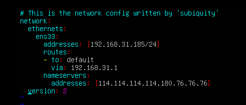
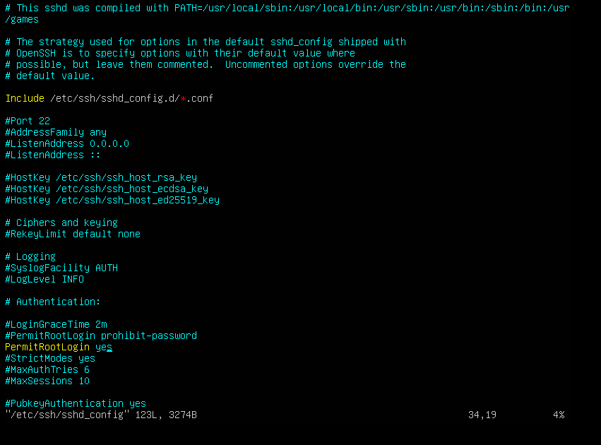

# linux 学习

### 常见问题

#### ubuntu系统相关

1. [镜像下载](https://repo.huaweicloud.com/ubuntu-releases/22.04/ubuntu-22.04-live-server-amd64.iso)
2. ubuntu 设置ip地址，并使之生效

   ```shell
   cd /etc/netplan
   vim 00-installer-config.yml
   netplan apply
   ```
   *00-installer-config.yml 文件内容见如下图片*
   
3. ubuntu 默认不开启root用户登陆，可以执行如下命令开启root用户登陆方式

   ```shell
   sudo passwd root
   ```
4. linux 远程登陆需要配置如下，把`PermitRootLogin prohibit-password`注释掉，改成添加`PermitRootLogin yes`

   ~~~shell
   vim /etc/ssh/sshd_config
   sudo /etc/init.d/ssh restart
   ~~~
   
